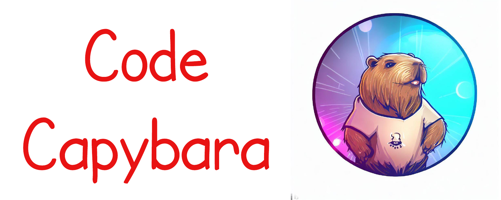

<p align="center" width="100%">
<a  target="_blank"></a>
</p>


# CodeCapybara: Open Source LLaMA Model that Follow Instruction-Tuning for Code Generation.
[](https://github.com/AI4Code-Research/CodeCapybara/blob/main/LICENSE)
[](https://github.com/AI4Code-Research/CodeCapybara/blob/main/DATA_LICENSE)
[](https://www.python.org/downloads/release/python-390/)
[](https://github.com/psf/black)

We introduce CodeCapybara - A Code specialized Instruction-following Large Language Model. This repo also attempts to evaluate and reproduce performance results of existing LLMs for code, such as Llama, Alpaca and CodeAlpaca for code generation benchmarks (HumanEval and MBPP).

- ***First attempt to reproduce of LLaMA results*** on widely recognized Code Generation benchmarks
- CodeCapybara is fine-tuned from Llama 7B. Larger models will be available soon. You can find our checkpoints at [this](#instruction-tuning).
- We use ***our own dataset in larger scale and more diverse*** to fine-tune Llama under an instruction-tuning style.
- ***Improved evaluation results on HumanEval*** in comparison to LLaMA, Alpaca and CodeAlpaca.
- Full transparency with open source availability: ***all scripts and models are accessible to the community***.
We encourage you to contribute to CodeCapybara and help advance the field of code generation. 

## Table of Contents

- [CodeCapybara: Open Source LLaMA Model that Follow Instruction-Tuning for Code Generation.](#codecapybara-open-source-llama-model-that-follow-instruction-tuning-for-code-generation)
  - [Table of Contents](#table-of-contents)
  - [Overview](#overview)
    - [Data Collection](#data-collection)
      - [Only Instruction Generation](#only-instruction-generation)
      - [Code Alpaca](#code-alpaca)
      - [DeepMind's Code Contests](#deepminds-code-contests)
    - [Instruction Tuning](#instruction-tuning)
  - [Results](#results)
    - [HumanEval Results](#humaneval-result)
    - [MBPP Results](#mbpp-result)
  - [Data Release](#data-release)
  - [Checkpoint Release](#checkpoint-release)
  - [Installation](#installation)
  - [Usage](#usage)
  - [Instruction Tuning](#instruction-tuning-1)
  - [Benchmarking](#benchmarking)
    - [HumanEval](#humaneval-1)
    - [MBPP](#mbpp-1)
  - [Reproducing LLaMA Results](#reproducing-llama-results)
  - [Example Outputs](#example-outputs)
  - [Future Plans](#future-plans)
  - [Contributing](#contributing)
  - [License](#license)

## Overview
We follow several recent techniques of instruction tuning to collect data and train an instruction-following model with ability to generate executable code from human language description.

We can divide our process for training CodeyCapybara into two stages:
1. **Data Collection**: We collect data generated through OpenAI `gpt-3.5-turbo` as well as code generation supervised dataset.
2. **Instruction Tuning**: We fine-tune our model from MetaAI's LLaMA checkpoint with parameter-efficient fine-tuning methods.

### Data Collection
In this stage, we follow previous works to collect instruction data. To ensure the quality of the code data used in the fine-tuning stage, we make some modifications from data Self-Instruct data generation procedure.
<!-- | Data source | No. samples |
|-|-|
|Only Instruction Generation| 20,574|
|CodeAlpaca| 20,022 |
|DeepMind's Code Contests| 13,328 |
| **Total**| **53,924**| -->

#### Only Instruction Generation
To ensure the code quality for later use as targets in the fine-tuning step,  we leverage an unsupervised dataset that only contains code snippets crawled from open-sources. We then design a prompt to ask `gpt-3.5-turbo` to generate a corresponding instruction for each code snippet. In other words, to obtain a pair (instruction-output), we ask `gpt-3.5-turbo` to generate the instruction given the output as human written code snippet.

Our unsupervised dataset contains code functions that covers a wide range of programming problem in 10 programming languages, i.e `Python, Javascript, Java, Golang, Ruby, Rust, PHP, C, C++, C#`

We obtain our dataset through `gpt-3.5-turbo` OpenAI API. Each instruction-output pair is generated through 2 rounds of API calling.
- In 1st round, we include a code function (i.e output) in the prompt, and ask `gpt-3.5-turbo` to generate a corresponding instruction.
- In 2nd round, since the code function does not guarantee an executable program, we include both 1st round generated instruction and code function to a new prompt and ask the model to generate an executable program with libraries imported and dependencies implementation along with the given code function.
 
- Our prompt template can be found [here](./data/prompts/prompt.py).
- Our script for 2 rounds of data generation can be found [here](./data_generation/data_generation.py).

#### [Code Alpaca](https://github.com/sahil280114/codealpaca)
For the second source of data, our intention is to follow [Self-Instruct](https://arxiv.org/abs/2212.10560) paper to completely generate various code problems in the format of (Instruction-Input-Output) data from a seed dataset.

We reuse the generated instruction data from [Code Alpaca](https://github.com/sahil280114/codealpaca/blob/master/data/code_alpaca_20k.json) to reduce API calling cost since what they did is similar to our purpose.

#### [DeepMind's Code Contests](https://github.com/deepmind/code_contests)
We also leverage the supervised code generation dataset. There are various code generation dataset with high quality and quantity, such as APPS (5,000 problems in train split), MBPP (500 problems in train split).

In this version, we select [DeepMind's Code Contests](https://github.com/deepmind/code_contests) dataset, which contains competitive programming problems with detailed description and test cases. The train split we employ to fine-tune our model contains 13,328 problems which results in 51,766 instruction-output pairs.

### Instruction Tuning
We tried 2 approaches to fine-tune LLaMA-7B checkpoint on the collected data, including:
- Full-parameter Fine-tuning
- Parameter-efficient Fine-tuning with HuggingFace's PEFT

Please refer to [Checkpoint Release](#checkpoint-release) section for accessing to our checkpoints.

## Results

We evaluate our models as well as reproduce other models' results on 2 benchmarks, HumanEval and MBPP. All numbers are reported in zero-shot settings.

### HumanEval Results
| Model |Base checkpoint | pass@1 | pass@10 | pass@100 |
| - | - | - | -  | - |
| LLaMA |  decapoda-research/llama-7b-hf | 10.70| 13.29 | **13.41** |
| LLaMA | huggyllama/llama-7b  |9.7  | 12.66| 12.80 |
| Alpaca-LoRA |  decapoda-research/llama-7b-hf | 8.00 | 10.00 | 10.37|
| CodeCapybara-LoRA |  decapoda-research/llama-7b-hf | 9.61 | 11.62 | 12.02 |
| CodeCapybara | huggyllama/llama-7b | **11.10** | **13.33** | **13.41** |

### MBPP Results

## Data Release
We release our data as well as other data sources used for training our models
- [Our Instruction Only Generation data](./data/raw-data/generated_data.jsonl)
- [Code Apaca data](https://github.com/sahil280114/codealpaca/blob/master/data/code_alpaca_20k.json)
- [Deepmind's CodeContests](https://huggingface.co/datasets/deepmind/code_contests) hosted on HuggingFace
<!You can find our used datasets in the folder `data/raw-data`, namely `code_alpaca_20k.json` (from CodeAlpaca) and `generated_data.jsonl` (our own dataset).!>

## Checkpoint Release
We release our checkpoints hosted on HuggingFace
- [CodeCapybara](https://huggingface.co/minhngh/CodeCapybara) - Full-parameter Fine-tuning
- [CodeCapypara-LoRA](https://huggingface.co/hungquocto/CodeCapybara-LoRA) - Parameter-efficient Fine-tuning

## Installation

```bash
conda create -n codecapybara -y
conda activate codecapybara
conda install pip -y
pip install -r requirements.txt
```

## Usage
Let's define a function to convert `instruction` and `input` into a single prompt as input to our `model.generate`
```python
def generate_prompt(instruction, input=None):
	# Templates used by Stanford Alpaca: https://github.com/tatsu-lab/stanford_alpaca
	if input is not None:
		prompt = f"Below is an instruction that describes a task, paired with an input that provides further context. Write a response that appropriately completes the request.\n\n### Instruction:\n{instruction}\n\n### Input:\n{input}\n\n### Response:"
	else:
		prompt = f"prompt_no_input": "Below is an instruction that describes a task. Write a response that appropriately completes the request.\n\n### Instruction:\n{instruction}\n\n### Response:"
	return prompt
```

### Loading model
You can choose to load full-parameter `CodeCapybara` or `CodeCapybara-LoRA`
#### Loading CodeCapybara

```python
import sys
import torch
from transformers import LlamaTokenizer, LlamaForCausalLM

tokenizer = LlamaTokenizer.from_pretrained("minhngh/CodeCapybara")
model = LlamaForCausalLM.from_pretrain("minhngh/CodeCapybara",
									  load_in_8bit=True,
									  dtype=torch.float16,
									  device_map="auto")

model.config.pad_token_id = tokenizer.pad_token_id = 0
model.config.bos_token_id = 1
model.config.eos_token_id = 2

if torch.__version__ >= "2" and sys.platform != "win32":
	model = torch.compile(model)

model.half()
```

#### Loading CodeCapybara-LoRA

```python
import sys
import torch
from transformers import LlamaTokenizer, LlamaForCausalLM
from peft import PeftModel

tokenizer = LlamaTokenizer.from_pretrained("decapoda-research/llama-7b-hf")
model = LlamaForCausalLM.from_pretrained("decapoda-research/llama-7b-hf",
									  load_in_8bit=True,
									  dtype=torch.float16,
									  device_map="auto")
model = PeftModel.from_pretrained("hungquocto/CodeCapybara-LoRA",
								 load_in_8bit=True,
								 dtype=torch.float16,
								 device_map="auto")

model.config.pad_token_id = tokenizer.pad_token_id = 0
model.config.bos_token_id = 1
model.config.eos_token_id = 2

if torch.__version__ >= "2" and sys.platform != "win32":
	model = torch.compile(model)

model.half()
```
### Generate
After loading model to your device, add the following script to generate prediction
```python
instruction = "Write a Python program that prints the first 10 Fibonacci numbers"
prompt = generate_prompt(instruction)

input_ids = tokenizer(prompt)["input_ids"]

generation_config = GenerationConfig(temperature=0.1,
									top_k=40,
									top_p=0.75)
output_ids = model.generate(inputs,
						   generation_config=generation_config,
						   max_new_tokens=128)
output = tokenizer.decode(output_ids, skip_special_tokens=True, ignore_tokenization_space=True)
print(output)
```
## Instruction Tuning
We support 2 settings to fine-tune LLaMA models. In the first setting, we refine all the parameters using Fully Sharded Data Parallel, and for the rest, we currently utilize LoRA to adapt the models to the instruction tuning task. You can easily run such settings by the command
```bash
    bash scripts/train.sh
```

which calls `main/train.py`. We also provide some arguments to customize the training process
- --train-batch-size: batch-size of each gpu for training
- --val-batch-size: batch-size of each gpu for validating
- --num-workers: number of workers in the DataLoader
- --config-path: the path of the configuration file. We provide a template in the folder `configs`
- --model-type: setting's used to fine-tune. There are 2 valid values: `fine-tunning` and `lora`.
- --use-wandb: 0 if you don't use *wandb* for logging; otherwise, wandb is used.
Moreover, you can edit the configuration file `configs/config.yml` which contains some notable fields:
- checkpoint
  - dir: the folder contains all the checkpoints
  - old_checkpoint: the path of the old checkpoint. If it is null, the model'll train from scratch; otherwise, it continues training from this checkpoint.
  - epochs: the number of epochs between 2 consecutive model saves.
- epochs: number of epochs for training
- model:
  - hf_model: LLaMA model in HuggingFace format
  - lora: settings for LoRA method
- optimizer: specify optimizer
- scheduler: configurate the hypermeters for a warm-up learning-rate schedule
- max-seq-length: maximum length of the instruction and the response.

## Benchmarking
To evaluate checkpoints on HumanEval or MBPP benchmark, navigate to `main/`
```bash
cd main/
```

We use nucleus sampling for sampling next-token in each prediction step to generate multiple difference code outputs for each problem. Hyperparameter configuration used for our evaluation is specified in the command below.

### HumanEval
The first part of the below command generates multiple `.jsonl` files, which will be saved into `path/to/prediction/directory` by inference the model. The command follows after taking predictions as input to calculate pass@k.
```bash
# model inference
export CUDA_VISIBLE_DEVICES=0,1
N_PROCS=$(echo $CUDA_VISIBLE_DEVICES | tr "," "\n" | wc -l)
NUM_ITERATIONS=10

for _ in $(seq $NUM_ITERATIONS);
do
    python -m torch.distributed.run --nprocs ${N_PROCS} generate.py \
        --output_dir path/to/prediction/directory \
        --dataset_name 'humaneval' \
        --base_model 'minhngh/CodeCapybara' \
        --lora_weights '' \
        --batch_size 1 \
        --num_return_sequences 20 \
        --load_8bit True \
        --temperature 0.1 \
        --top_p 0.75 \
        --top_k 40
done

# Calculating pass@k with k=1,10,100
python eval_humaneval.py --prediction_dir path/to/prediction/directory
```

`n = NUM_ITERATIONS * batch_size * num_return_sequences`, where `n` is used to estimate `pass@k` as in the [Codex](https://arxiv.org/pdf/2107.03374.pdf) paper.

$${pass@k} = \underset{\text { Problems }}{\mathbb{E}}\left[1-\frac{C^{k}_{n-c}}{C^{k}_{n}}\right]$$

Here we choose `n = 200` as employed in the paper, which results in
- `NUM_ITERATIONS=10`
- `batch_size=1`
- `num_return_sequences=20`

### MBPP
Replacing the `humaneval` by `mbpp`
```bash
# model inference
export CUDA_VISIBLE_DEVICES=0,1
N_PROCS=$(echo $CUDA_VISIBLE_DEVICES | tr "," "\n" | wc -l)
NUM_ITERATIONS=10

for _ in $(seq $NUM_ITERATIONS);
do
    python -m torch.distributed.run --nprocs ${N_PROCS} generate.py \
        --output_dir path/to/prediction/directory \
        --dataset_name 'mbpp' \
        --base_model 'minhngh/CodeCapybara' \
        --lora_weights '' \
        --batch_size 1 \
        --num_return_sequences 20 \
        --load_8bit True \
        --temperature 0.1 \
        --top_p 0.75 \
        --top_k 40
done

# Calculating pass@k with k=1,10,80,100
python eval_mbpp.py --prediction_dir path/to/prediction/directory
```

##  Reproducing LLaMA Results
Since MetaAI released their official LLaMA checkpoints, there have been questions and efforts on reproducing their results on HumanEval and MBPP reported in [paper](https://arxiv.org/pdf/2302.13971.pdf). This repo wishes to reproduce LLaMA and other LLMs results on widely recognized Code Generation benchmarks.

To evaluate a HuggingFace LLaMA checkpoint on HumanEval or MBPP,  please pass the values of `--base_model` and `--dataset_name` the corresponding model and benchmark in the [evaluation script example](#humaneval).

You can also tweak hyperparameters i.e  `temperature`, `top-p`, `top-k` for trade-off between accuracy and diversity and in prediction. Tuning hyperparameters will lead to change in final results. Community is welcome for seeking optimal hyperparameter values.

We are in our progress of evaluating LLaMA official checkpoints without HuggingFace format checkpoint conversion.

## Example Outputs

## Future Plans

## Contributing

## License

Feel free to cite us
```bibtex
@misc{codecapybara,
	title = {CodeCapybara: Code Instruction Tuning},
	author = {},
	year = {2023},
}
```
